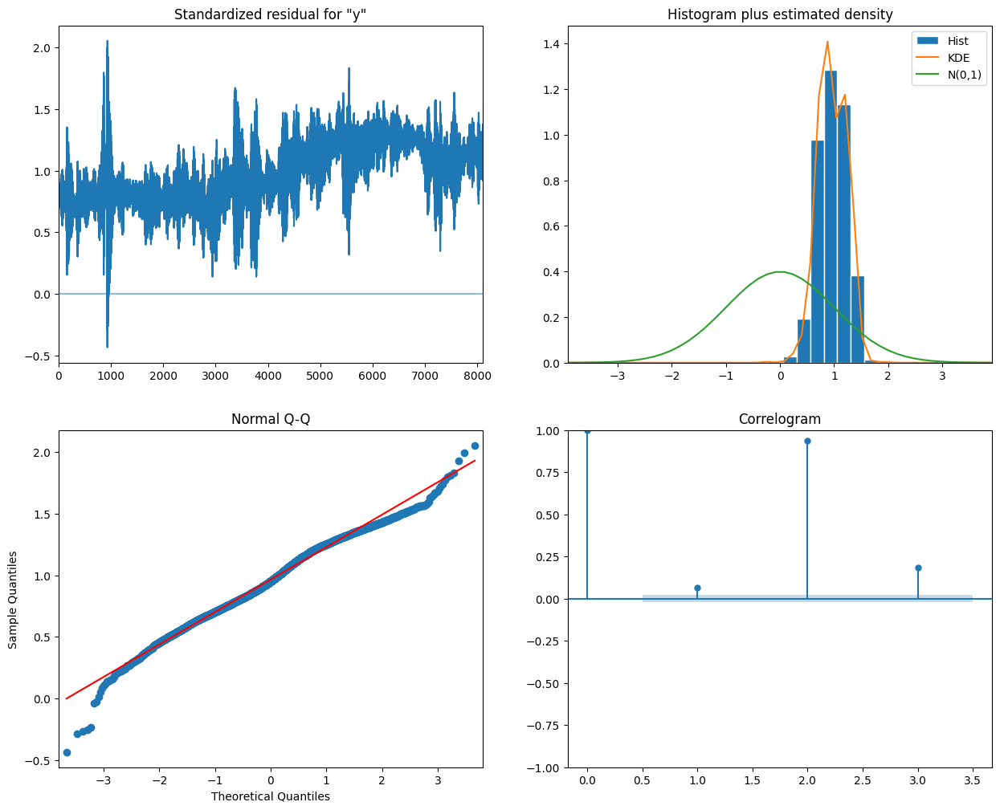

# PROBLEM: Crude Oil Prices (TIME SERIES - FORECASTING)

## Objective
The main goal is to predict future Crude Oil Prices based on the historical data available in the dataset.

I compared the results using different forecasting models such as LSTM, ARIMA, SARIMA and Prophet. And I selected the best between them.

## Dataset
The crude oil price movements are subject to diverse influencing factors. This dataset was retrieved from the U.S. Energy Information Administration: Europe Brent Spot Price FOB (Dollars per Barrel)

The data contains daily Brent oil prices from 17th of May 1987 until the 13th of November 2022.

You can download this dataset in this link: https://www.kaggle.com/datasets/mabusalah/brent-oil-prices

Example of some rows of the datset:

## EDA
Visualization of the full data:

Seasonality Check:

The Augmented Dickey-Fuller (ADF) test is a statistical test used to determine whether a time series is stationary or has a unit root. In simpler terms, it helps to check if a time series data set is stable over time or if it shows trends, cycles, or other non-stationary behaviors.

The ADF test is an extension of the Dickey-Fuller test and includes more complex models to account for higher-order autoregressive processes. The test works by testing the null hypothesis that a unit root is present in the time series sample. If the null hypothesis is rejected, it suggests that the time series is stationary

------------------------------------------------------------------
We are working with the series Original Series

ADF Statistic Value from the precalculated tables: -2.89
ADF Statistic Value: -1.9918544071295257

Significance Level to consider the series as stationary: 0.05
p-value: 0.29015603926422134

Conclusion: The p-value is greater than the significance level of 0.05, so we fail to reject the null hypothesis. This means the Original Series is not stationary and has a unit root.

------------------------------------------------------------------
We are working with the series Log Series

ADF Statistic Value from the precalculated tables: -2.89
ADF Statistic Value: -1.8032940879348056

Significance Level to consider the series as stationary: 0.05
p-value: 0.37882750115650377

Conclusion: Similar to the Original Series, the p-value is greater than 0.05, so we fail to reject the null hypothesis. The Log Series is also not stationary and has a unit root.

------------------------------------------------------------------
We are working with the series Diff Log Series

ADF Statistic Value from the precalculated tables: -2.89
ADF Statistic Value: -16.427113494485894

Significance Level to consider the series as stationary: 0.05
p-value: 2.4985801611428892e-29

Conclusion: The p-value is significantly less than 0.05, so we reject the null hypothesis. This indicates that the Diff Log Series is stationary and does not have a unit root.

------------------------------------------------------------------

In summary, only the Diff Log Series is stationary, while the Original Series and Log Series are not.

## Models

ARIMA stands for Autoregressive Integrated Moving Average. It is a popular statistical method used for time series analysis and forecasting. 

Components of ARIMA:
- Autoregressive (AR) part: This component involves regressing the variable on its own lagged (past) values. The order of the AR part is denoted by 
p, which indicates the number of lagged values included in the model.
- Integrated (I) part: This component involves differencing the data to make it stationary. The order of differencing is denoted by 
d, which indicates the number of times the data has been differenced.
- Moving Average (MA) part: This component involves modeling the error term as a linear combination of error terms from previous time steps. The order of the MA part is denoted by q, which indicates the number of lagged forecast errors included in the model.

Notation
An ARIMA model is typically denoted as ARIMA(p,d,q), where:
- p is the number of lagged values in the autoregressive part.
- d is the number of times the data has been differenced.
- q is the number of lagged forecast errors in the moving average part.

Steps to Build an ARIMA Model
- Identification: Determine if the time series is stationary. If not, apply differencing to achieve stationarity. Identify the values of 
p,d, and q using autocorrelation (ACF) and partial autocorrelation (PACF) plots.
- Estimation: Estimate the parameters of the ARIMA model using the identified values of p, d, and q.
- Diagnostic Checking: Evaluate the model by checking the residuals to ensure they resemble white noise (i.e., they are uncorrelated and have a constant mean and variance).

For time series data with seasonality, the ARIMA model can be extended to include seasonal components. This is known as the SARIMA model, denoted as ARIMA(p,d,q)(P,D,Q)_m, where:
- P, D, and Q are the seasonal autoregressive, differencing, and moving average terms, respectively.
- m is the number of periods in each season.

ARIMA models are widely used in various fields such as finance, economics, and environmental science for forecasting future values based on past data. They are particularly useful for short-term forecasting when the underlying data shows patterns that can be captured by the model.

The basic ARIMA model can be extended further by incorporating the seasonality of the series and exogenous variables. In this case, we would be talking about the SARIMAX model represented by (p, d, q) x (P, D, Q) S: where the parameters (P, D, Q) represent the same idea as (p, d, q) but deal with the seasonal part of the series.

The parameter S, in turn, represents the number of periods that must pass for the seasonality to repeat: 12 for months, 4 for quarters, etc.

Next, we will use a basic "Gridsearch" to find the optimal parameters for the ARIMA model.

The AIC index is the Akaike Information Criterion and is used to choose a model from a set of possible models.

The index calculates the Kullback-Leibler distance between the model and the series.

One way to interpret the index is: we look for the model with the lowest index because it is the simplest one that fits the data.

Results:

ARIMA(0, 0, 0)x(0, 0, 0, 0)12 - AIC:44005.89651828141
ARIMA(0, 0, 1)x(0, 0, 0, 0)12 - AIC:32852.85064746736
ARIMA(0, 0, 2)x(0, 0, 0, 0)12 - AIC:22338.763866305933
ARIMA(0, 1, 0)x(0, 0, 0, 0)12 - AIC:-38408.70400998521
ARIMA(0, 1, 1)x(0, 0, 0, 0)12 - AIC:-38408.09013610819
ARIMA(0, 1, 2)x(0, 0, 0, 0)12 - AIC:-38400.4828086606
ARIMA(0, 2, 0)x(0, 0, 0, 0)12 - AIC:-33027.120719626895
ARIMA(0, 2, 1)x(0, 0, 0, 0)12 - AIC:-38385.43692396565
ARIMA(0, 2, 2)x(0, 0, 0, 0)12 - AIC:-38384.79469698934
ARIMA(1, 0, 0)x(0, 0, 0, 0)12 - AIC:-38412.520068436745
ARIMA(1, 0, 1)x(0, 0, 0, 0)12 - AIC:-38411.92836141219
ARIMA(1, 0, 2)x(0, 0, 0, 0)12 - AIC:-38404.3337960139
ARIMA(1, 1, 0)x(0, 0, 0, 0)12 - AIC:-38413.745151036215
ARIMA(1, 1, 1)x(0, 0, 0, 0)12 - AIC:-38406.142626349785
ARIMA(1, 1, 2)x(0, 0, 0, 0)12 - AIC:-38400.478433852404
ARIMA(1, 2, 0)x(0, 0, 0, 0)12 - AIC:-35169.787139358596
ARIMA(1, 2, 1)x(0, 0, 0, 0)12 - AIC:-38390.01756774341
ARIMA(1, 2, 2)x(0, 0, 0, 0)12 - AIC:-38380.641861678654
ARIMA(2, 0, 0)x(0, 0, 0, 0)12 - AIC:-38411.85909993508
ARIMA(2, 0, 1)x(0, 0, 0, 0)12 - AIC:-38409.7288865984
ARIMA(2, 0, 2)x(0, 0, 0, 0)12 - AIC:-38403.354952694004
ARIMA(2, 1, 0)x(0, 0, 0, 0)12 - AIC:-38406.314223321795
ARIMA(2, 1, 1)x(0, 0, 0, 0)12 - AIC:-38405.19214129968
ARIMA(2, 1, 2)x(0, 0, 0, 0)12 - AIC:-38400.50055351131
ARIMA(2, 2, 0)x(0, 0, 0, 0)12 - AIC:-36018.561928514995
ARIMA(2, 2, 1)x(0, 0, 0, 0)12 - AIC:-38387.65246896143
ARIMA(2, 2, 2)x(0, 0, 0, 0)12 - AIC:-38380.32673180649

The best model is (0, 0, 2), with AIC = 22338.763866305933

Results of the best model:

                 coef    std err       z         P>|z|      [0.025      0.975]
------------------------------------------------------------------------------
ma.L1          1.9639      0.003    592.633      0.000       1.957       1.970
ma.L2          1.0324      0.003    307.804      0.000       1.026       1.039
sigma2         0.8627      0.044     19.799      0.000       0.777       0.948

Prediction:

ARIMA model with the parameters (0, 0, 2) has as result of the rmse in test of 8.6

## Improvement

This resutls can be improved with other methods as Prophet applied on data serie.

Plot forecast:

Plot individual components of forecast: trend, weekly/yearly seasonality:

